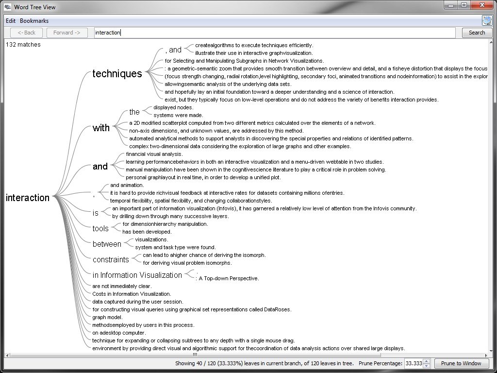

# Data visualization

## Datavisualization of search results or analytics results

Integrated visualization tools to visualize data or visualize text with charts, graphs or wordclouds:

## Trend chart (how many documents when)

[Trend chart](../analyze/trend): When how many results or documents?

## Networks, relations and connections (graph visualization)

The [visual graph explorer for graph visualization, discovery and exploration of connections](../analytics/graph) generates data visualizations of networks, connections and relations between named entities like persons, organizations or tags from the content of your documents.

## Word list and word cloud (words)

[Word list and word cloud](../analyze/words): Most used words, concept or names

## Visualize text for text mining (content)

[Visualize text for text analysis, text mining, document mining and words](../analytics/textmining): What content?

## Open Source Datavisualization tools for quantitative data

Open Semantic Search focus is on information retrieval, text analysis and text mining of mostly qualitative data from text documents wherefore the data sources can be vast amounts or masses of documents and considering their size of the corpus or data volume big data, too.

But for interactive data analytics and datavisualizations of quantitative data like numbers and diagrams you should use other open source data analytics and data visualization tools like [Apache Zeppelin](https://zeppelin.apache.org) supporting different data stores, [Kibana for Elastic Search](http://www.elastic.co/de/products/kibana) or Banana for Solr focused more on numbers and quantity than on text and quality.