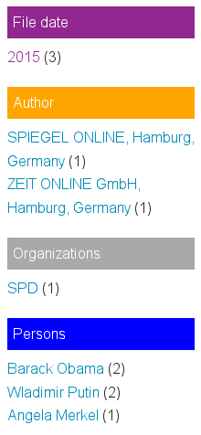
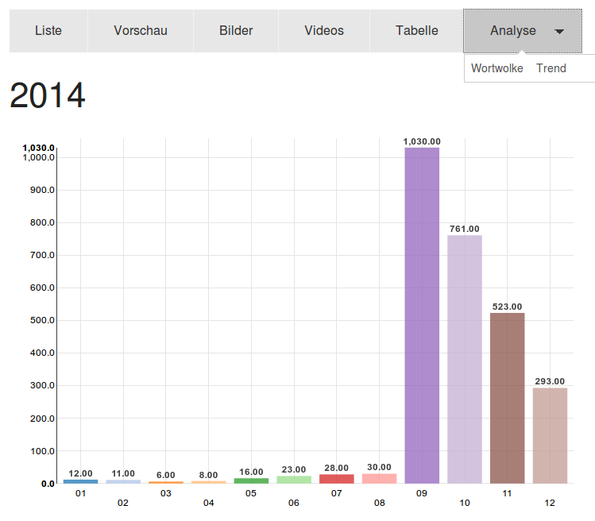

# How to search, explore, analyze, structure, filter and visualize large document collections or many search results

## Semantic search, exploratory search, interactive filters, data visualization, information retrieval, document discovery & text mining

How to combine semantic search, exploratory search, interactive filters & data visualizations for searching, information retrieval, document discovery, content mining & text mining to analyze, structure, filter and visualize search results, a large document collection or data:

## Index documents or data

To enable a fast search and data analysis, you have to extract and to index the data.

If not done automatically from time to time (f.e. by a cron job), start a crawl of the directory with the command line tool or with the web user interface or if you use the desktop search version you will find the option "Index for search" in the context menu for files and directories within the file manager.

Or copy the documents to a directory that is monitored or work in such a directory or fileshare, so new and changed files and documents will be indexed immediately and automatically.

After the text was extracted from the different formats or recognized by OCR and the data was enriched with different analyzers or qualitative data or structure, you can search, explore and analyse the texts and structures:

## Search operators

You can use [powerful search operators](operators) for your search query.

For example you can use wildcards like *, boolean algebra like AND, OR and NOT or fuzzy search.

## Overview and exploration with facets

With the **faceted search** (the right navigation sidebar for your search results), you can see an aggregated overview for the different facets like paths, concepts, persons, locations or organizations showing, how many documents matching this entity.

## Interactive filters

You can use this overviews or named entities as interactive filter to narrow down search results.

So a click to a facet (i.e. an organization) will drill down the search results to fewer documents, matching this additional facet/filter, too.

## Structure by named entities like organizations, concepts or tags

After importing or editing some [thesaurus entries or named entities like persons, locations, organizations or concepts](../datamanagement/thesaurus), you can explore your documents or search results by this named entities, which will be available as such aggregated overview and interactive filters.

If such named entities can not be extracted automatically by structured metadata of the thesuarus, your Named Entities database or named entity recognition because not matching their queries or machine learning models for automatic extraction of persons, organizations or places, you can [tag and annotate documents](../datamanagement/annotation) manually:

Just click *"Tagging and annotation"* for this document in the search results to annotate this document.

Add tags (f.e. concepts, persons, organizations or locations) or write some free text into the notes field.

## Table view

The sortable [table view](table) shows all columns/fields of the result list, for example URL, title, author and results of configured analyzers for data enrichment (f.e. extraction of email-addresses).

## Preview

The preview shows the full texts of the documents.

Your search context like the search query or active filters are marked inside the text, so you can see fast what is interesting for you and why the document has been found to your search context.

## Analysis and data visualization

The tab/button *Analyze* provides different [views and user interfaces for analysis and data visualization](../analytics) for the search results or for the whole document collection:

### Visualize and analyze dates with trend chars

[Visualize and analyze dates with trend charts](../analytics/trend):

### Text mining and content analysis

[Visualize and analyze contents with a word cloud and a words list for text mining](../analytics/textmining):

### Visualize and analyze networks and connections

[Visualize and analyze networks, connections and relations as visual graph](../analytics/graph):

## Interoperable open standards for data import and data export

Since this free software is open source and uses open standards you can integrate other tools and data or you can export the enriched data and use other additional tools for example for further and advanced data analysis tools, [text analysis, text mining and document mining tools](../analytics/textmining) or data visualization tools.