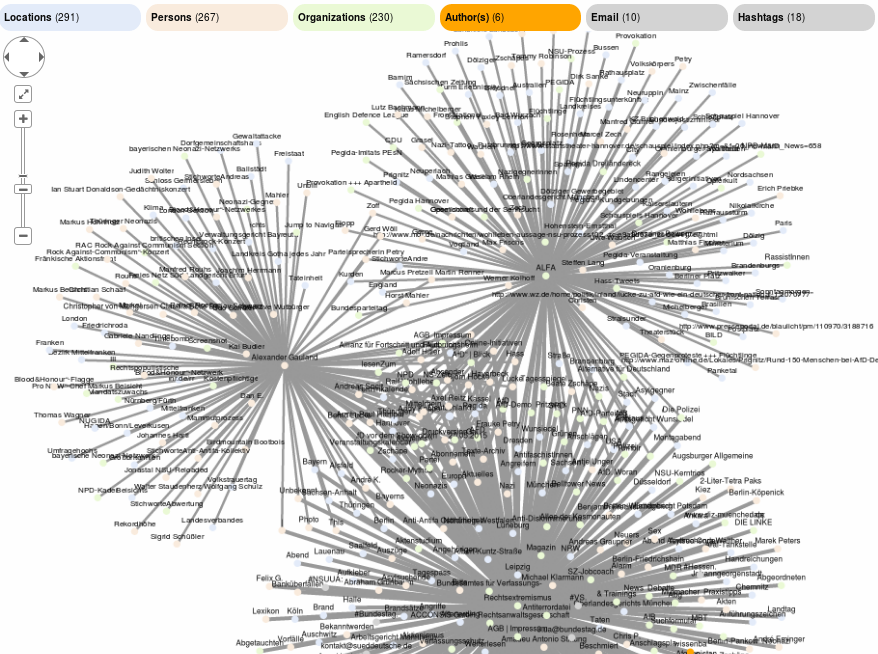
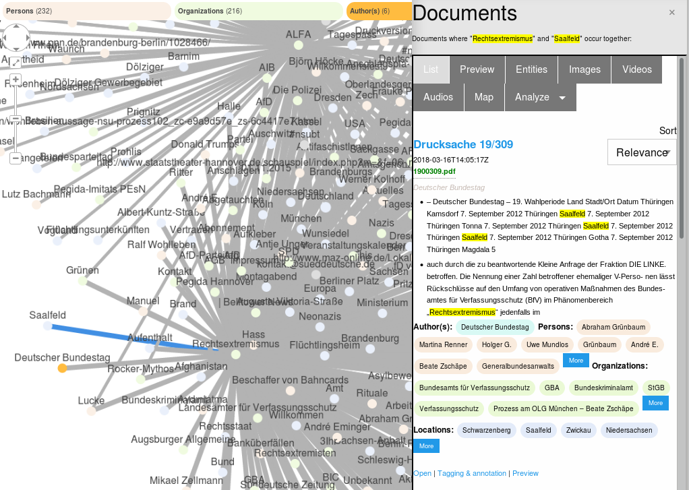

# Searching Linked Data (Open Semantic Knowledge Graph Search)

## Knowledge graph exploration and graph navigation

The graph/network analysis view shows you the direct and indirect relations, connections and networks between [named entities like persons, organizations or main concepts](../../datamanagement/named_entity_recognition) which occur together (co-occurrences) in your content, datasources and documents or are connected in your Linked Data Knowledge Graph.

## Graph visualization and graph analysis by full-text search

You can start a graph visualization from full text search (not only for entities, but for keywords in your documents, too) in the search user interface.

Therefore click on the view "Connections (Graph)" in tab/menu analysis.

There you can set which types (classes) of entities and connections (properties) to use for graph analysis and graph visualization and with how many of each entities to start with.

By click on the button "Visualize graph" you open the graph explorer and can extend the graph by clicking an entity / node.

## Graph visualization of potential connections between entities within documents (co-occurrences of named entities like persons, organizations or concepts)

You can view and analyze graphs and potential connections because of occuring in same documents (co-occuring named entities like persons, organizations, products, materials or concepts) with the [visual analysis view graph](../../analytics/graph):

## Semantic Search and Text Mining on Linked Data

With the Resource Description Framework (RDF) plugin you can use the semantic search engine as enterprise search engine and text mining platform for full text search, thesaurus based semantic search, faceted search and text mining of strings and texts (f.e. labels or literals) in structured data like **linked data** (LD), your domain knowledge graph, enterprise knowledge graphs or linked open data (LOD) knowledge graphs:

## Index linked data from Resource Description Framework (RDF) for full text search

After [import and indexing of Resource Description Framework (RDF) graphs](../../../connector/rdf) you can analyse, search and filter the RDF data (triples) granular by entities (RDF subjects):

## Granular filtering & analysis by seperated search result for each knowledge graph entity or subject

For each knowledge graph entity (RDF subject) there is an separated and granular search result with the document content type "knowledge graph" including all its properties (RDF predicates) as facets/fields/columns and all values (RDF objects) as values in such facets/fields/columns.

## Full text search, semantic text analysis and interactive filters or faceted search on linked data knowledge graphs

So you can find, filter and explore your linked data knowledge graph entries by full text search, overviews and granular interactive filters (faceted search on linked data) or by more advanced [text mining and natural language processing techniques](../../analytics/textmining) for text mining on linked data knowledge graphs.
