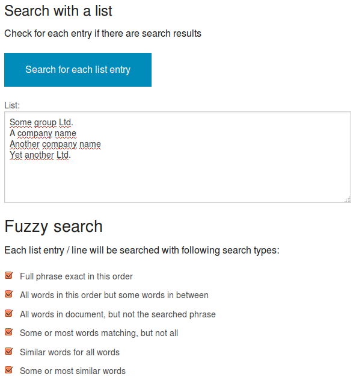
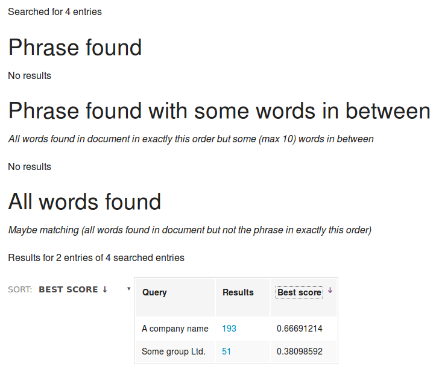

# Fuzzy search by lists of names

If you have not only some search queries but a whole list (i.e. a list of company names, products or organizations) and you want to search for every entry of this list, if there are results in your data, you can [import this list of names, dictionary or thesaurus with the ontologies manager and get an overview in how many documents the entries occur](../../datamanagement/ontologies).

Such an aggregated overview of named entities like names, organizations, persons, location or main concepts is very usefull since it is available automatically for all documents and all searches.

But this works only if the names in the list are written exact the same like the names in the documents.

If you want to do a [fuzzy search](../fuzzy) with a list to find the names even if not written correctly or not complete, you can use the fuzzy listsearch feature:

## Web interface (App) for fuzzy list search

Navigate to listsearch (menu point in your top bar, if your administrator allowed and [configured](../../../search-list) that).

Just paste a list with one entry per line to the "Query list" textarea and start the search by pressing the "Search" button.

This list can be (parts of) the content of a text file with one name per line or a single column (with many rows) copied and pasted from a spreadsheet.

## Fuzzy search

Searching with fuzzy search will take more time, but will find similar results, too - which often are exactly what you search for but it can not be found by exact matching i.e. because of typos or if a part of a company name like the suffix Ltd. is missing in some documents but is part of your search query. Or you want to find documents even if some chars were recognized wrong while automatic textrecognition (OCR) of scans).

So there will be a result list for each type of the enabled searches and fuzzy search methods.

Each additional search type or fuzzy search method query will exclude all results from (better matching but not finding all) enabled search types before, so you dont have to check the same results multiple times trying to find the additional found results by this additional fuzzy search method.

## Search results

Such a result list contains entries, that have been found in your indexed documents or data including the name of the entry, the count of results with a link to this results:

### Sorting by score

The result lists contain a column with the maximum score of the documents that matched that entry showing how near the best matching document is to your list entry or query.

Since the score column is sortable, you can check the most promising matches (most parts of the list entry found) until the results are too far away from your query (i.e. too few words of the query found) and do the same for the results of each different fuzzy search method.

So you can even use very very fuzzy search methods like "match if some similar words"-search using the search operator OR and fuzzy search, where often the most scored documents are what you search and you would not find them by the other methods (i.e. if a part of a company name like the suffix Ltd. is missing in some documents but is part of your search query) but most parts of the very big result list is very far away from the query and was found only because containing (a) very often used word(s) which are part of the query.

## Filter query

If you want to search for the entries of the list in a search context like special paths, URIs or only in documents containing some other words or matching a more or less complex search query, you can define additional search terms or filters in the field "filter query".
